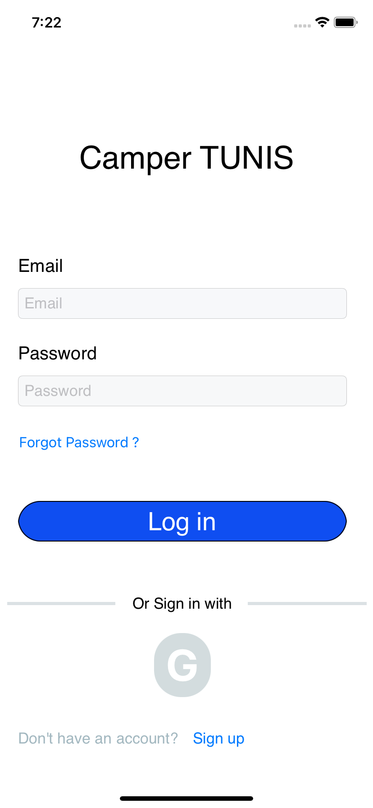
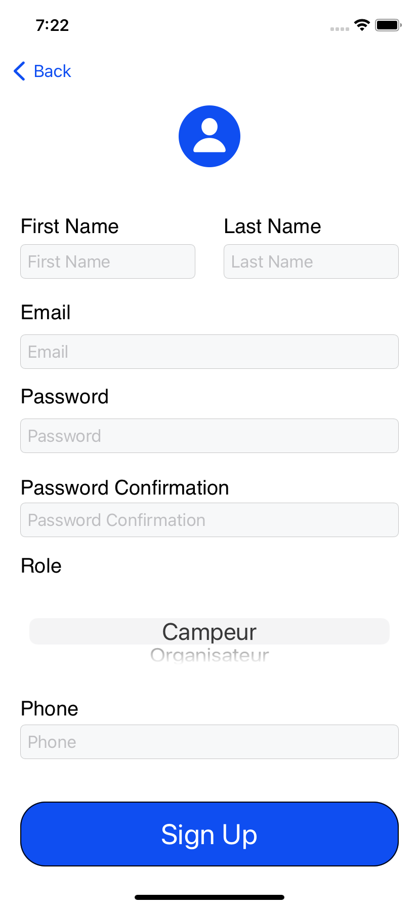
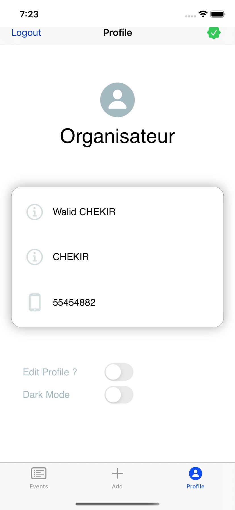
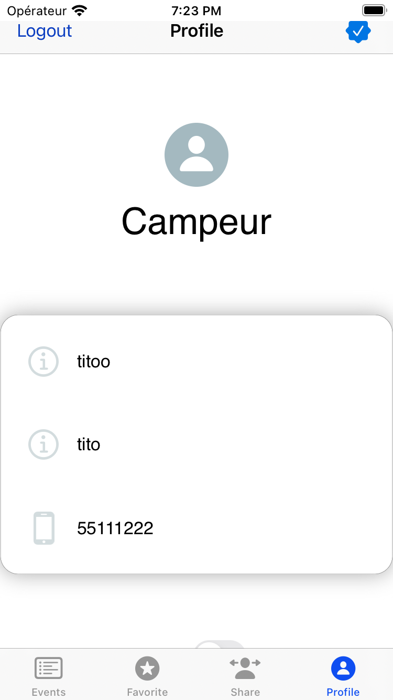
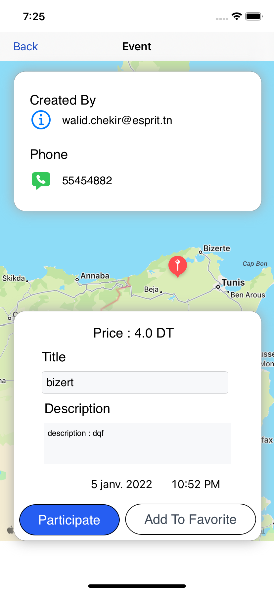
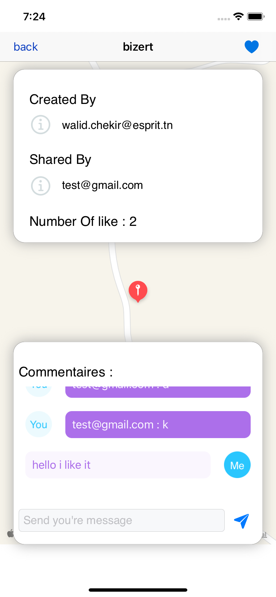

### Table of Contents CamperTN

- [Description](#description)
- [Technologies](#how-to-use)
- [Require](#how-to-use)
- [Screen](#how-screen)
- [License](#license)
- [Author Info](#author-info)

---

## Description

CamperTN présente une solution qui consiste à concevoir et à développer une application mobile qui permet de regrouper les campeurs professionnel et amateur de la Tunisie toute en permettant les organisateurs de proposer des évènements de Campings gratuits ou payants. Ainsi d’offrir au campeur des différents services comme la possibilité de favoriser un évènement c’est-à-dire sauvegarder toutes les données relatives à cet évènement, en plus lui offrir la posiblité d’évaluer, commenter et partager un évènement avec la communauté.

#### Technologies

- Technology Swit

---

## Require

- systeme d'exploitation macOS
- Xcode 13.2

## Screen

    

## License

MIT License

## Author Info

- chekir walid
- bellili mohamed amine
